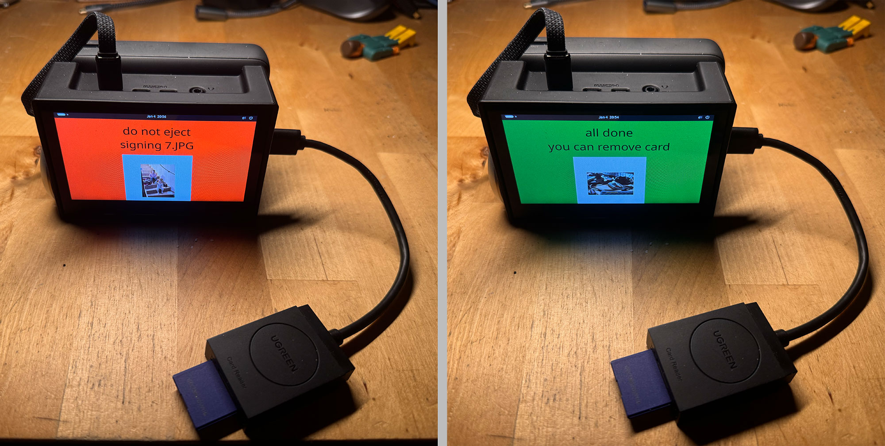
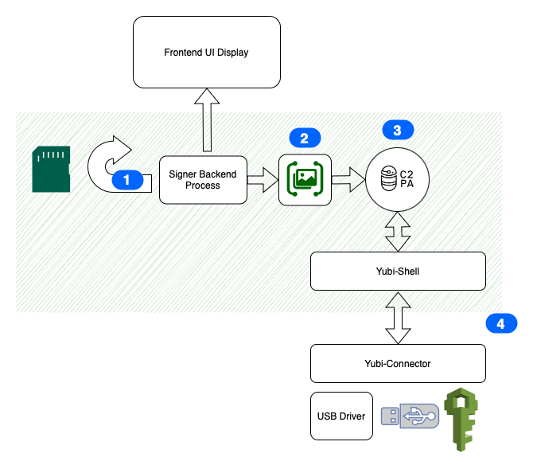

# C2PA Onprem software on Raspberry PI with HSM-Device for Siging Images/MP4-Files
This hardware setup offers the possibility to sign Images (JPG) and MP4-Files with given C2PA-Manifest.
This can be preperation of production workflow to sign all content, that will be used in production workflow.

Operation is easy. 
Simply inject SD-Card to Reader and wait for Siging all content on SD-Card. Once finished you can remove SD-Card from Reader.

The hardware can run autonomously from internet an power supply and sign all Images and Movies on SD-Card.
The Certificate is saved securely on HSM-Device and can not be extracted.

## Installation HSM-Device
1. YubiHSM-Shell
Install Packages [yubihsm-shell_2.6.0-3~bpo12+1_arm64.deb](yubi_arm64/yubihsm-shell_2.6.0-3~bpo12+1_arm64.deb) [libyubihsm-http2_2.6.0-3~bpo12+1_arm64.deb](yubi_arm64/libyubihsm-http2_2.6.0-3~bpo12+1_arm64.deb) [text](yubi_arm64/libyubihsm-usb2_2.6.0-3~bpo12+1_arm64.deb) [text](yubi_arm64/libyubihsm2_2.6.0-3~bpo12+1_arm64.deb) [text](yubi_arm64/libykhsmauth2_2.6.0-3~bpo12+1_arm64.deb)
2. YubiHSM-Connector
Install Package [yubihsm-connector_3.0.5-1~bpo12+1_arm64.deb](yubi_arm64/yubihsm-connector_3.0.5-1~bpo12+1_arm64.deb)

## Installation Software
1. Installation .NET8
Run `sudo apt-get update && sudo apt-get install -y dotnet-sdk-8.0`
2. Run Software on Autostart

## Installation RTC-Device
1. Installation Hardware
(Image)
2. Installation Libraries (https://dev.to/dev_neil_a/setup-an-rtc-module-with-ubuntu-2404-on-a-raspberry-pi-4-28mm)

## Configuration HSM-Device
1. Installation Private asymmetric Key
(https://docs.yubico.com/hardware/yubihsm-2/hsm-2-user-guide/hsm2-cmd-reference.html#put-asymmetric-key-command)
2. Run Signing with Yubi-HSM-Shell-Command
(https://docs.yubico.com/hardware/yubihsm-2/hsm-2-user-guide/hsm2-quick-start.html#prepare-to-sign-with-the-new-asymmetric-key)

## Short Introduction in running OnPrem Signing with Yubikey HSM USB Device

1. Signer Backend Process continuously scans for new JPEG and MP4-Files on SD-Card.
2. Once new File has found and if file is an Image, a thumbnail will be created and then
3. used while signing with given manifest-definition
To be signed claim-bytes will be sent to YubiHSM-Shell-Process 
Have a look using parameter `signer-path` ref. https://github.com/contentauth/c2patool?tab=readme-ov-file#signing-claim-bytes-with-your-own-signer
The signed claim bytes will be returned and manifest put into file.
4. Yubi-HSM-Shell will be used by Signer Backend Process. Yubi-HSM-Shell communicates via internal TCP Connection with Yubi-Connector, that acts as a "Signing-Server" (so that also other Signer-Backend Process as e.g. Docker-Containers can connect to). Yubi-Connector communicates via USB with Yubi-HSM-Stick, containing private key.

## Hardware
1. Raspberry Pi 4GByte (https://amzn.eu/d/dDLuCZQ)
2. Yubico HSM Device (https://www.yubico.com/de/product/yubihsm-2/) (https://www.yubikey-shop.at/products/yubihsm-2)
3. Waveshare 4.3 Zoll DSI LCD Display (https://amzn.eu/d/aFZp54M)
4. RTC Device (https://amzn.eu/d/9dlUARc)
5. Anker Powerbank (https://amzn.eu/d/6Uq873U) - Runtime about 10-20hours
